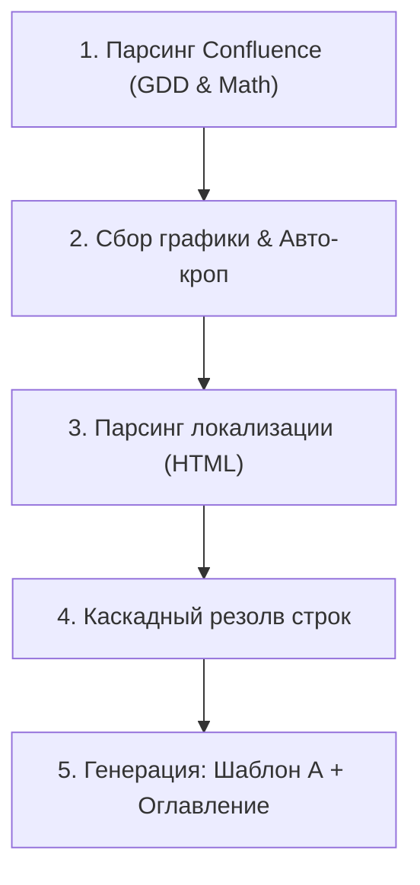
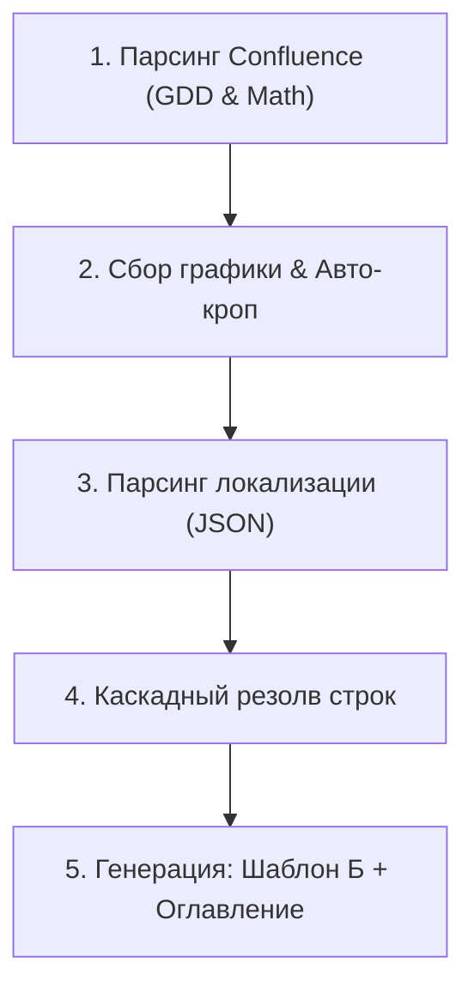

# Автоматизация сборки техдока: Мультиканальные RPA-парсеры

## Бизнес-задача и комплаенс

### Контекст и строгость регуляторики
iGaming-индустрия — один из самых жестко регулируемых рынков в мире. Требования международных регуляторов (MGA, UKGC) и тестовых лабораторий уровня **GLI (Gaming Laboratories International)** к лицензированию продуктов по уровню строгости, юридической ответственности и комплаенса полностью идентичны стандартам MedTech-отрасли.

### Проблема
Любая ошибка в математическом паспорте игры, неверно указанный RTP (Return to Player), волатильность или опечатка в правилах выплат ведут к мгновенному провалу сертификации в **GLI**, миллионным штрафам или отзыву лицензии. При этом сбор пакетов технической документации выполнялся вручную: данные были хаотично разбросаны по защищенным Confluence-пространствам, сырым локализационным файлам и репозиториям.

### Решение
Чтобы полностью исключить человеческий фактор, были спроектированы и внедрены **два независимых монолитных RPA-парсера**. Каждый скрипт изолирован, имеет линейную структуру и жестко кастомизирован под регламенты, формат данных и `.docx`-шаблоны конкретного B2B-клиента.

---

## Архитектура параллельных конвейеров данных

В зависимости от целевого клиента запускается один из двух специализированных, изолированных друг от друга пайплайнов:

### Пайплайн Клиента А (Спецификация HTML)

!!! info "Изоляция бизнес-логики"
    Пайплайны работают автономно и не имеют общих точек отказа. Выбор парсера и целевого шаблона определяется на этапе инициализации сборки конкретного игрового проекта.

### Пайплайн Клиента Б (Спецификация JSON)

---

## Техническая реализация

Каждый скрипт представляет собой завершенный монолитный конвейер, выполняющий последовательную обработку данных без избыточного архитектурного усложнения.

### 1. Извлечение данных (скрейпинг)

* **Парсинг Confluence:** Оба скрипта используют `Selenium` в `Headless`-режиме для обхода сессионных ограничений корпоративной базы знаний. Из Game Design Documents (GDD) и математических паспортов игр извлекаются таблицы символов, выплат и ключевые константы (RTP) с помощью точечных XPath-выражений.
* **Различия в обработке локализации:**
* **Парсер А (HTML):** Заточен под извлечение и очистку текстовых констант из сырых HTML-структур проекта.
* **Парсер Б (JSON):** Работает напрямую с JSON-деревьями локализации, выполняя строгую валидацию объектов.

* **Импорт графических ассетов:** Пайплайны обращаются к ресурсам игры, забирают нужные иконки/логотипы, проводят **автоматический кроп (обрезку)** под регламентированные ТЗ размеры и интегрируют их в документ.

### 2. Каскадный алгоритм поиска ключей (фоллбэк-логика)

Проблема разрозненных переводов решена единым для обоих скриптов алгоритмом каскадного разрешения строк:

1. **Локаль проекта:** Поиск текстового значения по ID ключа в словаре конкретной игры.
2. **Фоллбэк в Common:** Если ключ не найден, скрипт автоматически идет в глобальный общий словарь (`common`).
3. **Рекурсивное раскрытие вложенности:** При наличии ссылок на другие вложенные ключи, цепочка «Игра → Common» запускается рекурсивно.
4. **Безопасный откат:** При полном отсутствии совпадений в документ пишется сам сырой ID ключа, защищая текст от генерации пустот и потери контекста.

### 3. Динамическая адаптация под тип игры

Внутри каждого парсера заложена условная бизнес-логика. Скрипт считывает конфигурацию игры и динамически перестраивает логику подстановки переменных и структуру генерируемых разделов в зависимости от жанра и механик конкретного слота.

### 4. Генерация и контроль качества выходных документов

* **Уникальная шаблонизация:** Скрипты разворачивают данные в разные `.docx`-шаблоны. У каждого клиента зафиксированы свои корпоративные стили, сетки таблиц, шрифты и иерархия заголовков.
* **Автоматизированная проверка текста (линтинг):** На этапе финальной сборки выполняется сканирование текста с цветовой подсветкой триггерных слов, требующих обязательного ручного подтверждения или точечной замены лингвистом.
* **Генерация оглавления:** Автоматически собирается структура документа для удобства верификации регуляторами.

---

## Метрики и стабильность

!!! success "Результаты внедрения"
    * **Время сборки пакета документации:** Сокращено с нескольких часов монотонного ручного труда (ручной копипаст таблиц, вытаскивание графики и сверка ключей) **до 2 минут**.
    * **Точность:** Достигнут показатель в **99% успешных срабатываний** при высокой вариативности входящих данных.
    * **Надежность:** Инструменты стабильно функционируют в продакшене **более 1,5 лет со стабильным показателем 0 багов**, полностью исключая риски срыва релизных дедлайнов из-за ошибок человеческого фактора при комплаенсе.
