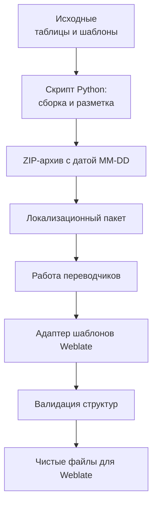

# Автоматизация контура локализации (сквозной пайплайн для Weblate)

## Бизнес-задача

### Контекст
Процесс отправки контента на перевод внешним подрядчикам и последующий импорт готовых строк в репозитории локализации (**Weblate**) сопровождался огромным объемом рутинной ручной работы. Требовалось собирать разрозненные таблицы, сверять глоссарии, формировать архивы и вручную подготавливать файлы к импорту.

!!! danger "Критические проблемы ручного контура"
    * **Высокая рутина:** Постоянный ручной копипаст строк между шаблонами техписателей, исходниками проектов и локализационными таблицами на десятках языков.
    * **Человеческий фактор:** Риск отправить переводчикам неактуальный исходник или импортировать в систему локализации файлы с нарушенной структурой ключей.
    * **Отсутствие визуального контроля:** Внешние переводчики часто нарушали правила использования глоссарных терминов, так как в исходных таблицах не было явной разметки.

### Цель
Разработать автоматизированный двусторонний конвейер для сборки, валидации, цветового кодирования и подготовки пакетов локализации к деплою в Weblate в режиме «одной кнопки».

## Схема двустороннего процесса
Процесс разделен на два логических контура — экспорт исходных данных и импорт готовых переводов, которые последовательно выполняются в рамках сквозного автоматизированного пайплайна.

## Техническая реализация

### 1. Прямой контур: подготовка и отправка (Экспорт)

* **Мерж и агрегация:** Скрипт принимает на вход разрозненные файлы (исходные тексты, таблицы-шаблоны с комментариями) и осуществляет их интеллектуальное слияние в единую рабочую среду.

* **Автоматическое цветовое кодирование (семантическая разметка):** Программа сопоставляет строки с корпоративным глоссарием и автоматически выделяет ключевые термины цветом прямо внутри ячеек результирующей таблицы. Это дает переводчикам жесткий контекст прямо в процессе работы и исключает порчу системных констант.

* **Сплиттер и динамическое тегирование пакетов:** Объединенный и размеченный файл автоматически расщепляется на изолированные целевые таблицы под конкретные языковые пары. Система упаковывает их в `.zip` архив, имя которого формируется автоматически с подстановкой короткой релизной метки текущего дня (формат `MM-DD`). Это полностью исключает коллизии версий при повторных запусках пайплайна и снижает когнитивную нагрузку на лингвистов при визуальном контроле свежести пакетов.

### 2. Обратный контур: приемка и подготовка к импорту (Импорт)

* **Обратная сборка (маппинг):** При получении выполненных переводов от подрядчиков скрипт запускает реверсивный конвейер сопоставления данных.

* **Валидация и нормализация:** Данные автоматически извлекаются из архивов, проходят валидацию структуры ключей на предмет случайных повреждений со стороны переводчиков.

* **Готовность к Weblate:** На выходе формируются идеально чистые, структурированные файлы локализации, полностью валидные для мгновенной загрузки в репозиторий Weblate без необходимости ручной правки синтаксиса.

## Архитектурный подход и эволюция

Инструмент был спроектирован как прагматичное MVP-решение для максимально быстрой автоматизации рутинного процесса.

* **Прагматизм:** На этапе запуска приоритетом была скорость внедрения. Использование переменных параметров внутри конфигурации скрипта позволило начать экономить часы рабочего времени уже в первый день эксплуатации, не дожидаясь разработки сложного UI.

* **Инженерная культура:** Процесс настройки (подготовка имен файлов и параметров) максимально документирован в пользовательской инструкции. Это позволило техническим писателям быстро освоить инструмент.

* **Путь развития:** Этот скрипт стал фундаментом для последующего создания полноценных инструментов и заложил основу для автоматизации всего пайплайна локализации в компании (*подробнее о развитии NLP-процессов автоматизации контроля качества читайте в кейсе [Full-Cycle LQA Framework](../cases/lqa-framework.md)*).

## Результаты внедрения

!!! success "Ключевые результаты"
    * **Экономия времени:** Рутинный процесс сборки и разбора пакетов локализации сократился **с нескольких часов до нескольких минут**.
    * **Прозрачность для лингвистов:** Благодаря автоматической цветовой разметке глоссария в исходниках, количество ошибок перевода из-за неверного контекста снизилось на порядок.
    * **Контроль целостности данных:** Полностью исключены ситуации, когда криво отформатированный переводчиками файл ломал структуру данных при загрузке в Weblate. Скрипт выступает в роли жесткого предварительного валидатора: ручной импорт пакетов теперь проходит без сбоев, откатов и ручной починки сломанных ключей.
