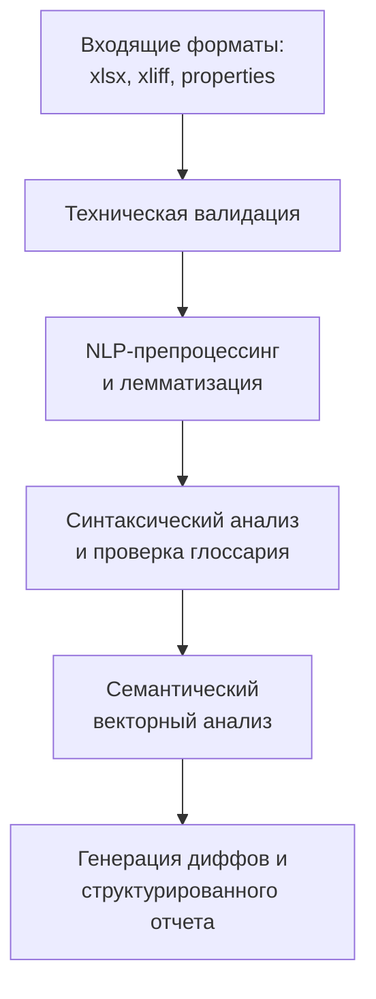

# Разработка и внедрение системы автоматизированного контроля качества (Full-Cycle LQA Framework)

## Бизнес-контекст и комплаенс

### Контекст
Масштабирование высоконагруженных iGaming-продуктов на международном рынке требует одновременной поддержки 37 языковых локалей для более чем 100 игровых проектов. Сфера регулируется международными лицензиарами (MGA, UKGC) и тестовыми лабораториями (GLI, BMM Testlabs) с высочайшей строгостью.

### Проблема и оптимизация ресурсов

* **Ограничения старых подходов**: До внедрения автоматизации валидация сложной типографики (например, арабской вязи) опиралась на базовый софт, основанный на жестких правилах (Rule-based). Это генерировало 100% ложноположительных срабатываний и требовало сотен часов ручной сверки.
* **R&D экспертиза**: Разработанный гибридный NLP-пайплайн был спроектирован и внедрен в формате самостоятельной разработки (solo-инженерии). Инструмент полностью покрыл потребности сложной языковой автоматизации, для реализации которых традиционно требуется выделение полноценных команд R&D.

!!! danger "Критические риски и человеческий фактор"
    * **Критические риски:** Любая лингвистическая неточность, искажение смысла правил игры или дефект разметки в одной из 37 локалей приводит к мгновенному отклонению софта аудиторами **GLI**, блокировке релиза и жестким штрафам.
    * **Человеческий фактор:** Ручной сбор данных, анализ глоссариев и регрессионный аудит колоссальных объемов текста занимали несколько рабочих дней, вызывая «замыливание» глаз у верификаторов.

## Архитектура и NLP-пайплайн

### Схема движения данных (Сквозной конвейер)
Система принимает на вход сырые данные (файлы `xlsx`, `xliff`, `properties`), глоссарии и базы контекстных терминов, прогоняя их через многоступенчатый лингвистический и семантический фильтр.

### Техническая реализация

1. **Техническая валидация:** До начала глубокого анализа проводится проверка синтаксиса: целостность плейсхолдеров, форматы цифр и знаков препинания с учетом хардкодной специфики каждого отдельного языка.
2. **NLP-препроцессинг и лемматизация:** Исходные тексты и словари нормализуются.
    
    **Решение проблемы мультиязычной токенизации:**

    * **Тайский язык:** Решена проблема полного отсутствия пробелов между словами.
    * **Арабский язык:** Используется связка `Stanza` + `CAMeL Tools`.
    * **Узбекский язык:** Внедрен специализированный `UzMorphAnalyser`.
    * **Малайский язык:** Интегрирована библиотека `Malaya`.

3. **Проверка глоссария и извлечение терминов:** Используется анализ графов зависимостей (`depparse`) для вычленения контекстных терминов и проверки консистентности перевода. При несрабатывании синтаксического парсера активируется фолбэк на алгоритмы обратного перевода.
4. **Семантический анализ (LaBSE):** Мультиязычная модель `Language-agnostic BERT Sentence Embedding` математически вычисляет смысловое расстояние между оригиналом и переводом.
5. **Формирование Diff-отчета и валидация капитализации:** Система проверяет регистр терминов по заданным правилам и генерирует наглядные Diff-строки с инлайн-подстановкой обратного перевода (Back-translation) для быстрого визуального контроля.

## Стек и отчетность

### Технологический стек

* **Язык и данные:** Python, Pandas, Numpy.
* **NLP-модели и фреймворки:** Hugging Face `Transformers`, `LaBSE` (Language-agnostic BERT), `RoBERTa`.
* **Лингвистические библиотеки:** `Stanza`, `NLTK`, `Malaya` (Malay), `CAMeL` (Arabic), `UzMorphAnalyser` (Uzbek).

### Структура итогового отчета

На выходе генерируется детализированный `.xlsx` файл, готовый как для работы живых редакторов, так и для последующей обработки языковыми моделями (LLM). Отчет содержит:

* `Код языка` и `Путь к файлу-исходнику`
* `Source text` (исходник) и `Target text` (перевод)
* `Массив кодов ошибок` (технических и глоссарных)
* `Semantic Similarity Score` (коэффициент смыслового сходства)
* `Diff-строки` и полный контур обратного перевода

## Результаты внедрения

!!! success "Результаты автоматизации"
    Внедрение фреймворка перевело процесс оценки качества в плоскость автоматизированного комплаенса, основанного на твердых данных (Data-Driven):

    * **Скорость и пропускная способность:** Полный цикл глубокого NLP-анализа пакета данных занимает **до 1 часа** (из расчета 30 сложных контекстных строк одновременно на 37 языках). Ранее это занимало несколько дней.
    * **Влияние человеческого фактора:** Пропуск технических багов, опечаток и слепых зон из-за усталости верификаторов **полностью исключен**.
    * **Снижение бизнес-рисков:** Стопроцентное покрытие релизных пакетов автоматизированными проверками гарантирует успешное прохождение внешнего лицензионного аудита в **GLI**.

## Доступность и пользовательский опыт (UX)

* **Прагматичный подход (низкий порог входа):** Инструменты разработаны как легковесные решения для оперативного устранения узких мест. Взаимодействие выстроено через модель декларативной конфигурации: менеджеры и лингвисты управляют параметрами запуска через простые файлы настроек, не прибегая к прямому редактированию исходного кода.
* **Гибкая архитектура:** Логика позволяет масштабировать процесс без усложнения интерфейса. Несмотря на отсутствие графической оболочки, инструменты обладают атрибутами зрелого продукта: от четкой структуры параметров до исчерпывающих гайдов по устранению неполадок (Troubleshooting), позволяющих команде самостоятельно разрешать конфликтные ситуации.
* **Фокус на эффективности:** Отказ от избыточного UI позволил сосредоточиться на главном — надежности NLP-пайплайнов и точности аналитики, сократив время внедрения автоматизации в рабочие процессы в разы.

## Аудит архитектуры и управление рисками

### Управление процессными рисками

В ходе эксплуатации разработанного конвейера был проведен проактивный анализ рисков его жизненного цикла в условиях масштабирования (при росте нагрузки свыше 15 релизных циклов в месяц).

!!! warning "Векторы уязвимостей и рекомендации по их минимизации"
    * **Критический Bus Factor:** Инструмент спроектирован как внутреннее кастомное решение. Замыкание архитектуры на экспертизе одного инженера создает риск деградации качества при кадровых изменениях и грозит возвратом отдела к ручному труду.
    * **Накопление технического долга:** Использование локальных скриптов, жестко адаптированных под динамичную структуру вендорских файлов, делает систему восприимчивой к малейшим изменениям форматов данных на стороне партнеров.
    * **Стратегия поддержки:** Для обеспечения отказоустойчивости процессов и предотвращения выгорания операционной команды, подобные инфраструктурные решения требуют планового рефакторинга, покрытия исчерпывающей документацией и своевременной передачи на поддержку централизованной ИТ-команде.
