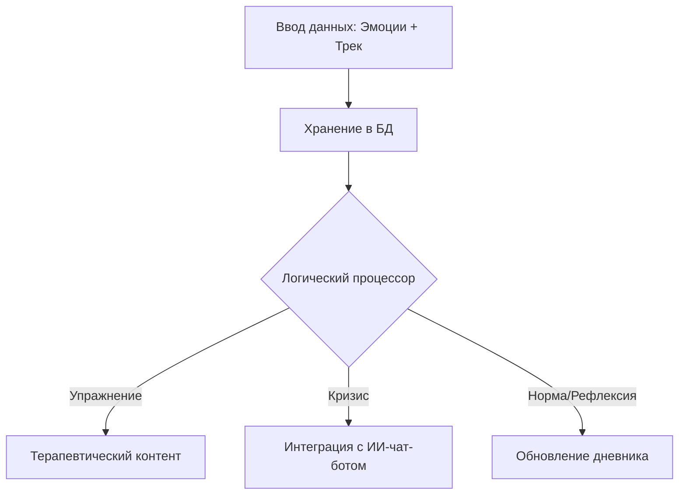

---
hide:
  - toc
---
# Разработка мобильного приложения Soundcheck

## Концепция проекта

### Суть продукта
Интеллектуальный ассистент для трекинга эмоционального состояния и работы с алекситимией. Пользователь фиксирует текущий эмоциональный фон и сопоставляет его с музыкальным контентом, формируя структурированные аудио-логи для последующей рефлексии.

!!! info "Моя роль: Ведущий инженер и аналитик"
    Полная ответственность за весь жизненный цикл разработки: от концептуального проектирования архитектуры данных до технической реализации логики маршрутизации пользователя.

## Архитектура и логика

### Архитектура данных
Спроектировала схему базы данных для хранения связок «Эмоциональный маркер — Музыкальный трек — Триггер состояния». Это позволяет системе сохранять динамический плейлист для возвращения пользователя в целевое состояние.

### Алгоритм взаимодействия
Реализовала дерево состояний, которое маршрутизирует пользователя в зависимости от выбора: упражнение, ИИ-чат-бот или логгирование текущего состояния.

## Исследования и реализация
!!! success "Результаты разработки"
    * **Системный анализ**: Проектирование сценариев взаимодействия с учетом специфики пользователей с алекситимией, требующих четкой структуризации данных.
    * **Инженерная реализация**: Собрала первую рабочую версию продукта, реализовав сложные логические ветвления без привлечения сторонних разработчиков.
    * **Валидация**: Провела цикл глубинных интервью для верификации того, насколько удобно пользователям самостоятельно классифицировать свое состояние через предложенные инструменты.