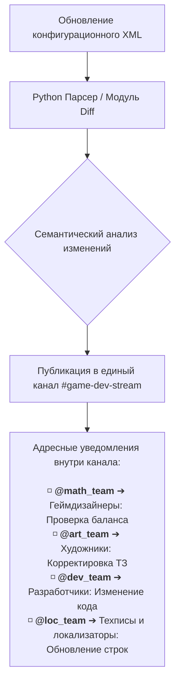

# Архитектура единого источника данных для пайплайна разработки

**Роль**: Технический писатель / Системный аналитик (Автоматизация процессов).  
**Статус проекта**: Исследовательский концепт / Оптимизация межотделочного взаимодействия.  
**Технологический стек**: Python (парсинг XML, генерация Diff), Rocket.Chat API (Webhooks / Bots), Git.  

---

## Бизнес-проблема и контекст
Разработка слотовых игр со сложной математикой — процесс, в котором задействовано множество отделов (разработчики, художники, геймдизайнеры, локализаторы и технические писатели). Рассинхронизация данных в таком конвейере генерирует критические бизнес-риски.

!!! danger "Критические риски рассинхронизации"
    * **Информационный хаос и каскадные переделки:** Изменения в математике или логике (например, активация сфер) тонут в общем потоке информации. В результате смежным отделам приходится по многу раз переделывать уже готовую работу.
    * **Смещение сроков релиза:** Возникают реальные прецеденты срыва сроков из-за того, что кто-то пропустил важное обновление в правилах игры или логике поведения символов.
    * **Угроза сертификации:** Любое расхождение между фактической работой слота и финальной внутриигровой справкой или локализацией несет прямой риск провала обязательной сертификации у регулятора.

---

## Концептуальное решение
Создание автоматизированной системы, которая превращает исходный конфигурационный файл игры (XML-матрицу) в **единый источник достоверных данных**. 

Система автоматически отслеживает любые изменения в логике или математике игры, формирует изолированные пакеты изменений (Diff) и агрегирует их в **едином корпоративном канале уведомлений**. Бот использует систему точечных адресных упоминаний для вызова конкретных проектных команд. Это сохраняет прозрачность истории изменений для менеджмента, но исключает информационный шум для линейных исполнителей.

---

## Архитектура и алгоритм работы

### Схема распределения адресных уведомлений

### Шаги обработки данных

1. **Парсинг:** Python-скрипт забирает обновленный XML-файл с актуальными конфигурациями и правилами игры.
2. **Генерация Diff:** Скрипт сравнивает новый XML с предыдущей стабильной версией и формирует выжимку (Diff) — только то, что реально изменилось.
3. **Семантическая разметка:** Каждому измененному узлу XML присваивается мета-тег назначения (например, `[MATH]`, `[UI]`, `[LOGIC]`, `[TEXT]`).
4. **Консолидированная доставка с таргетированием:** Бот отправляет сформированное сообщение в единый канал `#game-dev-stream`. На основе мета-тегов бот динамически подставляет нужную группу упоминания (например, `@math_team` для изменений в математике или `@loc_team` для правок в текстовых ключах).

Сотрудники получают уведомления только тогда, когда изменения напрямую затрагивают их зону ответственности, но при этом могут в любой момент изучить общую хронологию проекта в рамках одной ленты.

---

## Ожидаемый бизнес-эффект

!!! success "Эффективность концепта"
    * **Централизация логов:** Вся история изменений по продукту аккумулируется в одном месте, исключая рассинхронизацию между разрозненными чатами.
    * **Снижение когнитивной нагрузки:** Линейные специалисты избавлены от необходимости читать нерелевантный поток сообщений, реагируя строго на адресные триггеры системы.
    * **Стабилизация релизных циклов:** Исключается риск пропустить критическую правку — бот гарантирует стопроцентную доставку уведомления конкретному исполнителю.